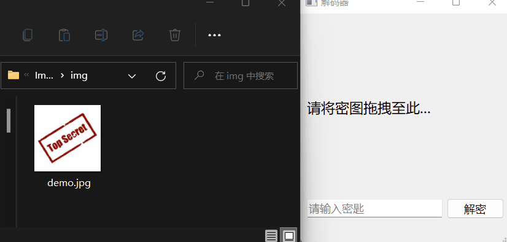

# ImageEncryption

实现图像加解密。

## 如何使用

### 预览

运行 `encryptor.py`，可以加载指定图像并预览加密、解密效果:

### 加密

运行 `main.py`，将需要加密的图像拖入其中，输入密码，点击按钮，即可对图像加密，加密后的图像保存在输入图像的同级目录中，效果如下：

### 解密

与加密相同：运行 `main.py`，将需要解密的图像拖入其中，输入密码，点击按钮，即可对图像解密，解密后的图像保存在输入图像的同级目录中。
