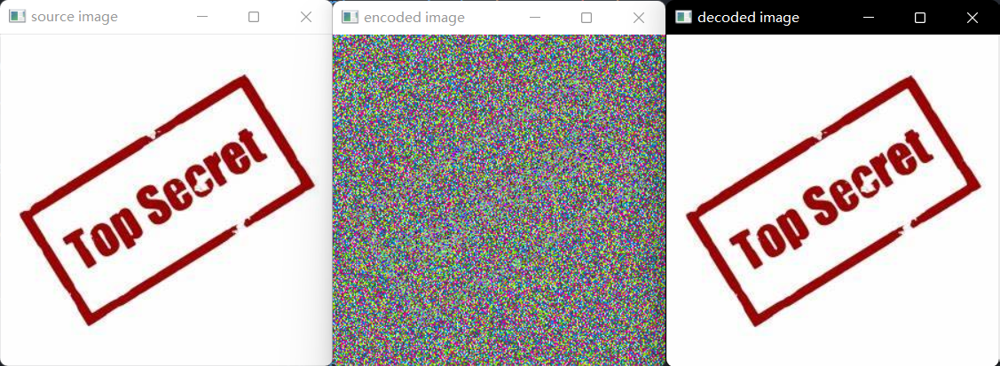
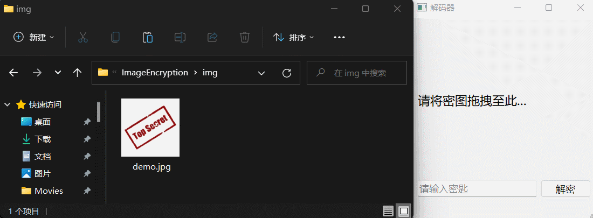

# ImageEncryption
Realize image encryption and decryption.

## How to use

### Preview

Run 'encryptor.py' to load the specified image and preview the encryption and decryption:

### Encryption

Run 'main.py', drag the image that needs to be encrypted into the UI, enter the key, click the button, and the image will be encrypted. The encrypted image is saved in the same folder as the input image:

### Decrypt

Same as encryption: run 'main.py', drag the image that needs to be decrypted into the UI, enter the key, click the button, and the image will be decrypted. The decrypted image is saved in the same folder as the input image.
